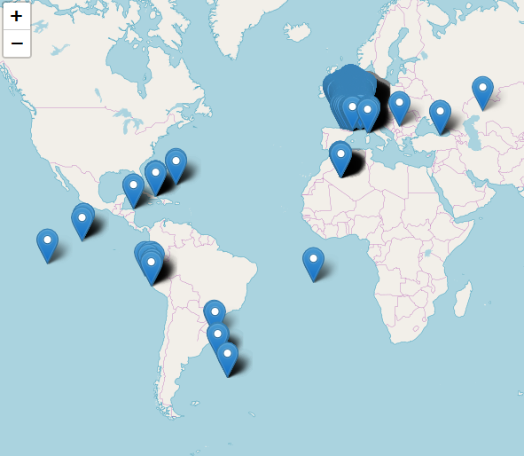
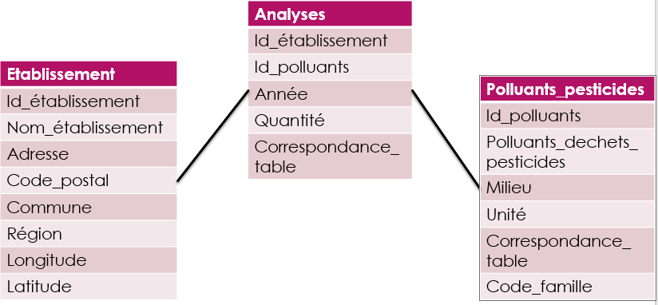

```{r library, include = FALSE}

library(shiny)
library(shinydashboard)
library(tidyverse)
library(leaflet)
library(sp)
library(sf)
library(DT)
library(knitr)
library(rmarkdown)
library(spdplyr)
library(flextable)

annee_pol <- 2010:2017
annee_pest <- 2010:2012
```

# Système d'information Géographique

_système d'information conçu pour recueillir, stocker, traiter, analyser, gérer et présenter tous les types de données spatiales et géographiques._


Choix des jeux de données: 

- Les polluants par établissement de Georisque 
- pesticide eaux souterraines de Data Gouv

Avantages :  

- Riche en information
- Contexte similaire

Inconvenants:  

- Organisation des informations
- Coordonnees


# Variabilité des Coordonnées

Importation du type de coordonnées géographique :

- Différence de projection 
- Georisque : lambert II (mais pas que...)
- Data Gouv : Lambert 93

Conversion des CRS : WGS84-EPSG4326

```{r probleme drom, echo=FALSE, fig.cap="Problème des coordonnées des Départements d'outre Mer", out.width = '50%', fig.align='center'}

```

# Entrepot de données

La méthode utilisé pour la construction de notre entrepôt de données au format étoiles (i2bi) est ETL:

- Extract, 
- Transform , 
- Load.

Intéret de cette méthode

- Permet de transférer des données brutes d'un système source, 
- Préparer la construction de l’ entrepôt de données


```{r entrepot, echo=FALSE, fig.cap="Organisation de l'entrepot", out.width = '50%', fig.align='center'}

```


# Cartes interactives

```{r data managing, include = FALSE}
Analyses <- readRDS("Entrepot/Analyses.rds") %>% sample_n(100000)
all_SPDF <- readRDS("Entrepot/SpatialPointsDataFrame_All_Etablissement.rds") %>% unique()
polluant_et_pesticide <- readRDS("Entrepot/polluant_et_pesticide.rds") %>% unique()
DROM <- c("MAYOTTE","MARTINIQUE","REUNION","GUADELOUPE","GUYANE")

region <- unique(all_SPDF$Region) %>% sort
annee <- unique(Analyses$Annee) %>% sort
type <- unique(Analyses$correspondance_table) %>% sort
milieu <- unique(polluant_et_pesticide$Milieu) %>% sort

```


```{r shiny, echo=FALSE}
shinyApp(
  
  ui <- fluidPage(
    fluidRow(
      column(3,
             selectInput("annee", h5("Quelle Annee ?"), 
                         choices = annee)
      ),
      column(3,
             
             selectInput("region", h5("Quelle Region ?"), 
                         choices = region,
                         selected = "Ile-De-France")
      ),
      column(3,
             selectInput("type", h5("Cause de pollution ?"), 
                         choices = type,
                         selected = "Emissions de Polluant")
      ),
      column(3,
             selectInput("polluant", h5("Choisissez un type de polluant/Dechet/Pesticide"), 
                         choices = "Tous"
                         
             )
      )
      
    ),
    
    leafletOutput("map_pol", height = 700)
    
    
  )
  ,
  
  server <- function(input, output, session) {
    
    
    
    map_pol_data <- reactive({ #je crée une liste de 2 élement : la base filtré par la sélection et les polluant à afficher dans le dernier menu
      
      
      df_etab <- all_SPDF %>% 
        filter(Region %in% input$region) # On filtre les établissemnts sur la région
      
      df_analyse <- Analyses %>% # On filtre la table Analyses sur la région
        filter(
          Annee == input$annee,
          correspondance_table == input$type,
          Id_Etablissement %in% unique(df_etab$Id_Etablissement)
        ) 
      
      
      df1 <- df_analyse %>% 
        inner_join(
          df_etab, by = c("Id_Etablissement")
        ) %>% unique()
      
      id_pol <- df1$Id_Polluant %>% 
        unique %>% 
        sort %>% 
        c(.)
      
      df2 <- polluant_et_pesticide %>% filter(Id_Polluant %in% id_pol)
      
      
      lab_selected <- df2 %>% mutate(
        lab = paste(Id_Polluant, Polluant_Dechet)
      ) %>% .$lab %>% unique %>% sort %>% c(.)
      names(id_pol) <- lab_selected
      
      
      
      if (input$polluant != "Tous"){
        df1 <- df1 %>% filter(Id_Polluant %in% input$polluant)
        df2 <- df2 %>% filter(Id_Polluant %in% input$polluant)
      }
      
      map_pol_data <- inner_join(df1,df2, by = "Id_Polluant") %>% unique()
      
      map_pol_data2 <- map_pol_data %>% 
        group_by(
          Nom_Etablissement,
          Adresse,
          Code_Postal, Commune, longitude, latitude
        ) %>% 
        summarise(
          Nombre_polluant = n(),
          Maximum = max(quantite),
          Unite = first(Unite)
        )
      
      
      
      
      
      return(list(map_pol_data2, id_pol))
    })
    
    
    
    
    
    
    
    
    output$map_pol <- renderLeaflet(
      leaflet(data = map_pol_data()[[1]]) %>%
        addTiles() %>% 
        addMarkers(
          popup = str_c(
            map_pol_data()[[1]]$Nom_Etablissement, "<br/>", 
            map_pol_data()[[1]]$Adresse, "<br/>", 
            map_pol_data()[[1]]$Code_Postal, " ",map_pol_data()[[1]]$Commune, "<br/>", 
            input$type, " : ", map_pol_data()[[1]]$Nombre_polluant, "<br/>",
            "Maximum : ", map_pol_data()[[1]]$Maximum, " ",map_pol_data()[[1]]$Unite
          ), 
          label = map_pol_data()[[1]]$Nom_Etablissement,
          clusterOptions = markerClusterOptions()
        )
    )
    
    observe({
      if (!input$polluant %in% map_pol_data()[[2]]){
        updateSelectInput(session, inputId = "polluant", choices = c("Tous", map_pol_data()[[2]]))
      }
    })
    
    
    
  }
  
)

```


# Analyses spatiales :

*Analyse de  la corrélation entre l’exposition aux polluants émient par les établissements et la répartition des patients atteints de la maladie X*

- standardisation en fonction de l'age et du sexe
- repartition des etablissements et de la maladie sur une carte 

```{r library pour analyse stat, include=FALSE}
library(epitools)
library(cartography)
library(DCluster)
```


```{r analyse statistique,message=FALSE, include=FALSE}


effectif_france <- read_delim("Sources/effectif.france.csv", ";", escape_double = FALSE, trim_ws = TRUE) # Nous importons la repartitions de l'effectif français en fonction du sexe et de l'âge

effectif_departement <- read_delim("Sources/effectif.departement.csv", ";", escape_double = FALSE, trim_ws = TRUE) # Nous importons la repartitions de l'effectif pour chaque departement en fonction du sexe et de l'âge

evenements <- read_delim("Sources/evenements.csv", ";", escape_double = FALSE, trim_ws = TRUE) # Nous importons la repartitions de la maladie en fonction du sexe et de l'âge pour chaque departement


# Nous faisons un standardisation directe en fonction de la repartition des age et du sexe pour l'ensemble de la métropole et cela pour pour tous les départements

ratio.vector <- vector()
for (i in colnames(evenements[,-1])) {
  ratio.vector <- append(ratio.vector, round(ageadjust.direct(count = evenements[,i], 
                                                              pop = effectif_departement[,i], 
                                                              stdpop = effectif_france[,2])["adj.rate"] *10^5, 2))
}
standdirect_dep <- tibble(dep = str_to_upper(colnames(evenements[,-1])), 
                          ratio = ratio.vector)

dep <- st_read('Sources/DEPARTEMENT.shp') # On importe un fond de carte des départements français et les données associées

# Et on ajoute nos données standardisées pour tous les départements
dep_ordre <- sort(dep$NOM_DEPT)
standdirect_dep <- standdirect_dep %>% 
  arrange(dep) %>% 
  mutate(dep = dep_ordre)

dep <- left_join(dep, standdirect_dep, by = c('NOM_DEPT' = 'dep'))

# On calcul la population totale par département

effectif.vector <- vector()
for (i in colnames(effectif_departement[,-1])) {
  effectif.vector <- append(effectif.vector, sum(effectif_departement[,i], na.rm =TRUE))
}

effectif_departement_tot <- tibble(NOM_DEPT = str_to_upper(colnames(evenements[,-1])) %>% 
                                     str_replace_all("[.]","-") %>% #on remplace les points des noms de lignes par des tirest
                                     stringi::stri_trans_general("ascii"),  # on retire les accents
                                   effectif = effectif.vector)

```


```{r, include = FALSE}


ana2016 <- Analyses %>% 
  filter(Annee == 2016,
         correspondance_table == "Emissions de Polluant"
  ) %>%
  dplyr::select(-Annee,-correspondance_table)

df_etab <- all_SPDF %>% filter(!Region %in% DROM) %>% 
  inner_join(ana2016) %>% unique() %>% mutate(
    CODE_DEPT = str_extract(Code_Postal, "^[0-9][AB0-9]")
  ) %>% mutate(
    CODE_DEPT = ifelse(CODE_DEPT == 20, "2A", CODE_DEPT)
  )


id_pol <- unique(ana2016$Id_Polluant)

df_etab_coord <- df_etab %>% 
  dplyr::select(longitude, latitude) %>% # On sélectionne les variables contenant les coordonnées
  st_as_sf(coords = c("longitude", "latitude"), crs = 4326) %>% # On renseigne le système de positionnement (WSG84), 
  st_transform(crs = 2154) # et on le transforme pour qu'il soit compatible avec notre carte

```

```{r repartition de polluant et de la maladie, echo=FALSE}

#On peut donc représenter cela sur une carte :
par(mar = c(0,0,1,0)) 
choroLayer(dep,
           var = 'ratio',
           method = 'quantile', # méthode de discrétisation
           col = carto.pal("orange.pal", 9), 
           border = "black",
           lwd = 1.5, 
           legend.values.rnd = 1, 
           legend.pos = 'left', 
           legend.title.txt = 'Incidence/100000 hab.') 
plot(df_etab_coord, pch = 20, add = TRUE) 
layoutLayer(title = "Incidence en 2016 de la maladie X",
            sources = "Sources : http://www.georisques.gouv.fr",
            author = "Auteur : Jouffroy Jordan ",
            scale = 0, 
            frame = TRUE,
            col = "#688994") 


```


```{r, include=FALSE}

df_etab2 <- df_etab %>% group_by(CODE_DEPT) %>% summarise(
  mean_quant = mean(quantite, na.rm = TRUE) #On récupère la moyenne de polluant emis
) %>% left_join(
  dep %>% transmute(CODE_DEPT = CODE_DEPT %>% as.character, NOM_DEPT = NOM_DEPT %>% as.character, ratio, X_CENTROID, Y_CENTROID)
) %>% mutate(
  NOM_DEPT = NOM_DEPT %>% str_replace_all("[' ]","-")
)

df_etab_dep <- df_etab2 %>% 
  left_join(
    effectif_departement_tot
  ) %>% 
  transmute( #On récupère uniquement les données utilisées dans le test de stone
    Observed = ratio,
    Expected = mean_quant/effectif,
    x = X_CENTROID %>% as.numeric(),
    y = Y_CENTROID %>% as.numeric()) %>% filter(!is.na(Expected))


region<-which(df_etab2$CODE_DEPT=="75")
st_stat <- stone.test(Observed~offset(log(Expected + 1)), df_etab_dep, model="poisson", R=99, 
                      region=region, lambda=1)

sign <- ifelse(st_stat[1]>=0.05,"n'est pas significative","est significative")
```

# Analyse pour l'ensemble des polluants 

Test de Stone : le risque depend de la distance à la source => rééchantillonage

- Répartition a peu près gaussienne


```{r, echo=FALSE}
paste0("- Statistique de ",round(st_stat$t0,2)," : la pvalue ", sign)
```


```{r repartition quantite, echo=FALSE}

ggplot(
  data = df_etab_dep,
  aes(x = log(Expected + 1))
) + geom_histogram(bins = 10)
```


# Analyse par Polluant

```{r, include = FALSE}
id_pol_list <- vector(mode = "list", length = length(id_pol))

for (i in 1: length(id_pol)){
  prov <- df_etab %>% 
    filter(Id_Polluant == id_pol[i])  %>% group_by(CODE_DEPT) %>% #On groupe par département
    summarise(
      mean_quant = mean(quantite, na.rm = TRUE) # On récupère la quantité moyenne de polluant émise dans le départements
    ) 
  
  prov2 <- prov %>% 
    full_join(dep %>% transmute(
      CODE_DEPT = CODE_DEPT %>% as.character, 
      NOM_DEPT = NOM_DEPT %>% as.character, 
      ratio, X_CENTROID, 
      Y_CENTROID
    ), by = "CODE_DEPT" ) %>% mutate(
      NOM_DEPT = NOM_DEPT %>% str_replace_all("[' ]","-")
    )
  
  
  df_etab_dep <- prov2 %>% 
    left_join(
      effectif_departement_tot, by = "NOM_DEPT"
    ) %>% 
    transmute(
      Observed = ratio,
      Expected = mean_quant/effectif,
      x = X_CENTROID %>% as.numeric(),
      y = Y_CENTROID %>% as.numeric()
    ) %>% transmute(
      Observed, x, y,
      Expected = ifelse(is.na(Expected),0,Expected)) %>% filter(!is.na(Expected) & !is.na(Observed))
  
  
  
  region<-which(prov2$CODE_DEPT=="75")
  st_test <- stone.test(Observed~offset(log(Expected +1 )), df_etab_dep, model="poisson", R=99, 
                        region=region, lambda=1) 
  
  t0 = as.numeric(st_test[1])
  p_value <- ifelse(abs(t0) > 1.96, "<0.05", ">0.05")
  
  id_pol_list[[i]] <- data.frame(Polluant = id_pol[i], t0 = st_test[1], P_value = p_value)
}

df_id_pol <- data.table::rbindlist(id_pol_list)

pp <- polluant_et_pesticide %>% dplyr::select(Id_Polluant, Nom_Polluant = Polluant_Dechet) 

```

```{r resultat, echo=FALSE, fig.align='center', warning=FALSE}

df_id_pol %>% arrange(t0) %>% 
  slice(1:8) %>% 
  left_join(pp, by = c("Polluant" = "Id_Polluant")) %>% 
  unique() %>% dplyr::select(Polluant, Nom_Polluant, everything()) %>% 
  kable(
    caption = "Tableau recapitulatif des résultat de test de Stone",
    align = "c", row.names = FALSE
  )
```


Conclusion :

- Pas de correlation pour P042, P043 et P044  
- mais pour les autres si
- Pas significatif globalement : CO2 le plus largement émis

Avec une correction de bonferroni :

- P value < 0.05/99 soit presque 0.0005
- t0 > 3.29053


