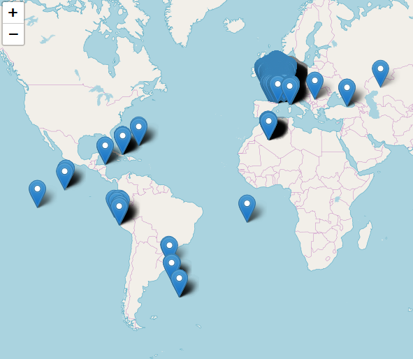

# Importation des librairies

Avant de commencer à créer l’entrepôt de données, nous importons toutes les librairies afin d'avoir un visuel concis de celle ci.

```{r library, warning=FALSE, message=FALSE}
knitr::opts_chunk$set(message= FALSE, warning=FALSE)

library(shiny)
library(shinydashboard)
library(tidyverse)
library(leaflet)
library(sp)
library(sf)
library(knitr)
library(rmarkdown)
library(spdplyr)

annee_pol <- 2010:2017
annee_pest <- 2010:2012
```


# Construction de l'entrepôt de données

## Gestion des polluant et des pesticide

Nous avons choisi comme source de données les polluants de 2010 à 2017 et les pesticides de 2010 à 2012 car elles concernaient des sujets proches et toutes 2 des établissements (de mesure dans un cas et émetteurs dans l'autre). Nous avons donc pour chaque type de pollution, créé une table de polluant et une table qui contient les quantité émise, produite, traité ou mesuré. les types étaient : Emissions de polluant, Production de déchet, traitement de déchet et mesure de pesticide.  

Pour chacune des tables qui va nous permettre de créer notre entrepôt, nous sélectionnons les variables de manière uniforme les variables :

- pour la table centrale : l'identifiant de l'établissement, l'identifiant du polluant, l'année, la quantité et le type de polluant (nom de la table initiale)
- pour la table des polluant : l'identifiant et le nom du polluant, le milieu d’émission ou la famille du polluant s'il y a, l'unité de mesure et le type de polluant (nom de la table initiale)  

Pour les données issus de georisque, il n'y avait pas d'identifiant clair, nous en avons donc créé nous même :

- Emission de polluant : P et 3 chiffres
- Production de déchet dangereux : PD et 3 chiffres
- Production de déchet non dangereux : PND et 3 chiffres
- Traitement de déchet dangereux : TD et 3 chiffres
- Traitement de déchet non dangereux : TND et 3 chiffres

Pour celles issus de Data gouv, nous avons repris l'identifiant auquel on a ajouté _PE_ avant

### Emission de polluant

```{r table polluant}

# On crée tout d'abord un identifiant pour chaque type de polluant de la table emissions


emission_list <- vector(mode = "list", length = length(annee_pol))
for (i in 1:length(annee_pol)){
  emission_list[[i]] <- read.csv2(paste0("Sources/Polluant_et_dechet/emissions",annee_pol[i],".csv"), stringsAsFactors = FALSE, sep = "," ,encoding="UTF-8")
}

emission <- data.table::rbindlist(emission_list)

corres_emission <- tibble(
  Libelle_Polluant = emission$Polluant %>% unique(), # on récupère chaque type de polluant
  Id_polluant = sprintf("P%03.f",row_number(Libelle_Polluant)) # on lui attribue un identifiant qui commence par P
)

emission1 <- emission %>% 
  left_join(
    corres_emission, by = c("Polluant" = "Libelle_Polluant" )
  ) %>% 
  mutate(
    # ajout de l'id de la table
    correspondance_table = "Emissions de Polluant")


emission_fusion  <- emission1 %>% 
  transmute(
    Id_Etablissement= Identifiant ,
    Id_Polluant = Id_polluant ,
    Annee = Annee_Emission,
    quantite = as.numeric(quantite),
    correspondance_table)

emission_final <- emission1 %>% 
  dplyr::select(
    Id_Polluant = Id_polluant,
    Polluant_Dechet = Polluant,
    Milieu,
    Unite = unite,
    correspondance_table
  )


```

### Production et traitement de Dechet

Les productions et traitements de déchet étaient scindées en 2 tables chacune, nous les avons donc traité séparément

#### Production de Dechet Dangeureux

```{r union tables production dechet dangereux}

prod_dang_list <- vector(mode = "list", length = length(annee_pol))
for (i in 1:length(annee_pol)){
  prod_dang_list[[i]] <- read.csv2(paste0("Sources/Polluant_et_dechet/Prod_dechets_dangereux",annee_pol[i],".csv"), stringsAsFactors = FALSE, sep = "," ,encoding="UTF-8")
}

prod_dang <- data.table::rbindlist(prod_dang_list)


corres_prod_dechet_dang <- tibble(
  Libelle_Dechets = prod_dang$Libelle_Dechet %>% unique(), # on récupère chaque type de dechet
  Id_dechet = sprintf("PD%03.f",row_number(Libelle_Dechets))
)

production_Dechet_Dangeureux1 <- prod_dang %>% 
  left_join(
    corres_prod_dechet_dang, by = c("Libelle_Dechet" = "Libelle_Dechets" )
  ) %>% 
  mutate(correspondance_table = "Production de Dechet Dangeureux",
         Code_Departement = as.character(Code_Departement)
  )

production_Dechet_Dangeureux_fusion <- production_Dechet_Dangeureux1 %>% 
  transmute(
    Id_Etablissement= Identifiant ,
    Id_Polluant = Id_dechet ,
    Annee,
    quantite = Quantite %>% as.numeric(),
    correspondance_table = correspondance_table)

production_Dechet_Dangeureux_final <- production_Dechet_Dangeureux1 %>% dplyr::select(
  Id_Polluant = Id_dechet,
  Polluant_Dechet = Libelle_Dechet,
  Unite,
  correspondance_table
)

```


#### Production de Dechet Non Dangeureux

```{r union tables production dechet non dangereux}

prod_non_dang_list <- vector(mode = "list", length = length(annee_pol))
for (i in 1:length(annee_pol)){
  prod_non_dang_list[[i]] <- read.csv2(paste0("Sources/Polluant_et_dechet/Prod_dechets_non_dangereux",annee_pol[i],".csv"), stringsAsFactors = FALSE, sep = "," ,encoding="UTF-8")
}

prod_non_dang <- data.table::rbindlist(prod_non_dang_list)


corres_prod_dechet_Nondang <- tibble(
  Libelle_Dechets = prod_non_dang$Libelle_Dechet %>% unique(), # on récupère chaque type de dechet
  Id_dechet = sprintf("PND%03.f",row_number(Libelle_Dechets))
)

production_Dechet_NonDangeureux1 <- prod_non_dang %>% 
  left_join(
    corres_prod_dechet_Nondang, by = c("Libelle_Dechet" = "Libelle_Dechets" )
  ) %>% mutate(
    correspondance_table = "Production de Dechet Non Dangeureux",
    Code_Departement = as.character(Code_Departement)
  )

production_Dechet_NonDangeureux_fusion <- production_Dechet_NonDangeureux1 %>% 
  transmute(
    Id_Etablissement= Identifiant ,
    Id_Polluant = Id_dechet ,
    Annee,
    quantite = Quantite %>% as.numeric(),
    correspondance_table = correspondance_table)

production_Dechet_NonDangeureux_final <- production_Dechet_NonDangeureux1 %>% 
  dplyr::select(
    Id_Polluant = Id_dechet,
    Polluant_Dechet = Libelle_Dechet,
    Unite,
    correspondance_table
  )

```


#### Traitement de Dechet Dangeureux

```{r union tables traitement dechet dangereux}

trait_dang_list <- vector(mode = "list", length = length(annee_pol))
for (i in 1:length(annee_pol)){
  trait_dang_list[[i]] <- read.csv2(paste0("Sources/Polluant_et_dechet/Trait_dechets_dangereux",annee_pol[i],".csv"), stringsAsFactors = FALSE, sep = "," ,encoding="UTF-8")
}

trait_dang <- data.table::rbindlist(trait_dang_list)


corres_trait_dechet_dang <- tibble(
  Libelle_Dechets = trait_dang$Libelle_Dechet %>% unique(), # on récupère chaque type de dechet
  Id_dechet = sprintf("TD%03.f",row_number(Libelle_Dechets))
)

traitement_Dechet_Dangeureux1 <- trait_dang %>% 
  left_join(
    corres_trait_dechet_dang, by = c("Libelle_Dechet" = "Libelle_Dechets" )
  ) %>% mutate(
    correspondance_table = "Traitement de Dechet Dangeureux",
    Code_Departement = as.character(Code_Departement)
  )

traitement_Dechet_Dangeureux_fusion <- traitement_Dechet_Dangeureux1 %>% 
  transmute(
    Id_Etablissement = Identifiant ,
    Id_Polluant = Id_dechet ,
    Annee,
    quantite = Quantite_traitee %>% as.numeric(),
    correspondance_table = correspondance_table)

traitement_Dechet_Dangeureux_final <- traitement_Dechet_Dangeureux1 %>% dplyr::select(
  Id_Polluant = Id_dechet,
  Polluant_Dechet = Libelle_Dechet,
  Unite,
  correspondance_table
)

```


#### Traitement de Dechet Non Dangeureux

```{r union tables traitement dechet non dangereux}
trait_non_dang_list <- vector(mode = "list", length = length(annee_pol))
for (i in 1:length(annee_pol)){
  trait_non_dang_list[[i]] <- read.csv2(paste0("Sources/Polluant_et_dechet/Trait_dechets_non_dangereux",annee_pol[i],".csv"), stringsAsFactors = FALSE, sep = "," ,encoding="UTF-8")
}

trait_non_dang <- data.table::rbindlist(trait_dang_list)

corres_trait_dechet_Nondang <- tibble(
  Libelle_Dechets = trait_non_dang$Libelle_Dechet %>% unique(), # on récupère chaque type de dechet
  Id_dechet = sprintf("TND%03.f",row_number(Libelle_Dechets))
)

traitement_Dechet_NonDangeureux1 <- trait_non_dang %>% 
  left_join(
    corres_trait_dechet_Nondang, by = c("Libelle_Dechet" = "Libelle_Dechets" )
  ) %>% mutate(
    correspondance_table = "traitement de Dechet Non Dangeureux",
    Code_Departement = as.character(Code_Departement)
  )

traitement_Dechet_NonDangeureux_fusion <- traitement_Dechet_NonDangeureux1 %>% 
  transmute(
    Id_Etablissement= Identifiant ,
    Id_Polluant = Id_dechet ,
    Annee,
    quantite = Quantite_traitee %>% as.numeric(),
    correspondance_table = correspondance_table)

traitement_Dechet_NonDangeureux_final <- traitement_Dechet_NonDangeureux1 %>% 
  dplyr::select(
    Id_Polluant = Id_dechet,
    Polluant_Dechet = Libelle_Dechet,
    Unite,
    correspondance_table
  )

```

### Mesure de la Concentration des pesticide

```{r arrangement pesticide}
concentration_pesticide_list <- vector(mode = "list", length = length(annee_pest))
for (i in 1:length(annee_pest)){
  concentration_pesticide_list[[i]] <- read.csv2(paste0("Sources/Pesticide/ma_qp_fm_ttres_pesteso_",annee_pest[i],".csv"), stringsAsFactors = FALSE, sep = ";" ) %>% mutate(Annee = annee_pest[i])
}

concentration_pesticide <- data.table::rbindlist(concentration_pesticide_list)

concentration_pesticide_fusion <- concentration_pesticide %>% transmute(
  Id_Etablissement= as.character(CD_STATION) ,
  Id_Polluant = paste0("PE",as.character(CD_PARAMETRE)) ,
  Annee,
  quantite = MA_MOY %>% as.numeric(),
  correspondance_table = "Concentration en Pesticide")

pesticide <-  read.csv2("Sources/Pesticide/pesticides.csv", stringsAsFactors = FALSE, sep = ";") 

concentration_pesticide_final <- pesticide %>% dplyr::transmute(
  Id_Polluant = as.character(CD_PARAMETRE),
  Polluant_Dechet = LB_PARAMETRE,
  CODE_FAMILLE,
  Unite = "µg/l",
  correspondance_table = "Concentration en Pesticide"
)


```


# Compilation des données

Nous avons compilé chacune des 2 tables produites en 2 tables distinctes : **Analyses** qui contient les informations des quantités de chaque établissement et **polluant_et_pesticide** qui contient les informations de chaque type de polluant dont son appellation et nous les avons sauvegardés au format RDS (plus léger pour github)

```{r creation table centrale et table polluant}

Analyses <- emission_fusion %>% 
  bind_rows(production_Dechet_Dangeureux_fusion) %>% 
  bind_rows(production_Dechet_NonDangeureux_fusion) %>% 
  bind_rows(traitement_Dechet_Dangeureux_fusion) %>% 
  bind_rows(traitement_Dechet_NonDangeureux_fusion) %>% 
  bind_rows(concentration_pesticide_fusion) %>% unique()

polluant_et_pesticide <- emission_final %>% 
  bind_rows(production_Dechet_Dangeureux_final) %>% 
  bind_rows(production_Dechet_NonDangeureux_final) %>% 
  bind_rows(traitement_Dechet_Dangeureux_final) %>% 
  bind_rows(traitement_Dechet_NonDangeureux_final) %>% 
  bind_rows(concentration_pesticide_final) %>% unique()

saveRDS( Analyses, "Entrepot/Analyses.rds")
saveRDS( polluant_et_pesticide, "Entrepot/polluant_et_pesticide.rds")


```


nous nettoyons ensuite l'environnement pour libérer de la place.  


```{r nettoyage 1}
rm(list = ls())
gc()
```


## Gestion des établissements

Ici un problème s'est posé à nous : ce n'est pas en soit le fait d'avoir 2 sources de données avec des systèmes de coordonnées différentes, mais surtout que dans un cas le système de coordonnées n'étaient pas uniforme pour le même jeu de données mais qu'en plus il contenaient des erreurs.

En effet, si le système de coordonnées pour la base de données des pesticides étaient en Lambert 93 et donc simple à compilé pour la représentation géographique, celui des polluants n'étaient pas référencé clairement d'une part, mais différait selon la région et contenait une erreur. Concernant l'erreur, il s'agit de l'établissement avec l'Identifiant 589.00648 en 2017 et 89288528 avant. J'ai pu corriger cette erreur en regardant que dans le document registre des établissement, la longitude et la latitude étaient des combinaison linéaires des coordonnées x et y. Donc pour cette établissement et ceux de Mayotte, à partir de leur Coordonnées X et Y, j'ai pu retrouver la longitude et la latitude. J'ai utilisé le même raisonnement après avoir testé les projections usuelles pour les DROM avec sp. Pour cela j'ai recherché les coordonnées en WGS84 de quelques établissement pour chaque DROM et j'ai fait un modèle de régression linéaire en fonction de Coordonnees_X et Coordonnees_Y. Cela a une imprécision de quelques kilomètres mais permet de corriger l'affichage suivant

```{r probleme drom, echo=FALSE, fig.cap="Probleme coordonnees DROM", out.width = '50%'}

```

Pour les autres établissements de France métropolitaine, la projection utilisée étaient celle de Lambert II étendu au lieu d'une Lambert 93 comme indique sur le site georisque. Une fois cela compris, il a suffit de transformer le système de coordonnées en WGS et de combiner les 3 jeux ainsi créés.


```{r gestion coordonnees}


annee_pol <- 2010:2017

etablissement_list <- vector(mode = "list", length = length(annee_pol))
for (i in 1:length(annee_pol)){
  etablissement_list[[i]] <- read.csv2(paste0("Sources/Polluant_et_dechet/etablissements",annee_pol[i],".csv"), stringsAsFactors = FALSE, sep = "," ,encoding="UTF-8") %>% mutate(Annee = annee_pol[i])
}

etablissement <- data.table::rbindlist(etablissement_list) %>% unique()

registre <- read.csv2("Sources/Polluant_et_dechet/registre-francais-des-emission-polluantes-etablissements.csv", stringsAsFactors = FALSE, sep = ";" ,encoding="UTF-8")


etablissement2 <- etablissement %>% mutate(
  Nom_Etablissement = toupper(Nom_Etablissement),
  Numero_SIRET = as.character(Numero_SIRET),
  Coordonnees_X = as.numeric(Coordonnees_X),
  Coordonnees_Y = as.numeric(Coordonnees_Y)
) %>% rename(
  Id_Etablissement = Identifiant
) %>% dplyr::select(
  -code_eprtr, -Code_APE, -libelle_eprtr, -Libelle_APE, -Departement, -Numero_SIRET
)


#Les Longitudes et les latitudes des etablissements étant manquants dans le fichier etablissement
# Nous sommes allé les récupérer dans le fichier registre des etablissement

test_etab <- registre %>% filter(!is.na(coordonnees), Identifiant %in% etablissement2$Id_Etablissement, coordonnees != "") %>% transmute(
  Id_Etablissement = Identifiant,
  coordonnees_x = as.numeric(coordonnées_x),
  coordonnees_y = as.numeric(coordonnées_y),
  coordonnees,
  latitude = str_extract(coordonnees, ".*(?=,)") %>% as.numeric(),
  longitude = str_extract(coordonnees, "(?<= ).*") %>% as.numeric()
) 

# Cependant, nous n'avons pas de coordonnees pour tous nos etablissement dans ce document
# donc nous avons fait une représentation graphique pour voir que la relation entre les coordonnées X et y
# est proche de la linearité avec longitude et la latitude respectivement 


ggplot(
  data = test_etab,
  aes(
    x = coordonnees_x,
    y = longitude
  )
) +
  geom_point() + labs(title = "Représentation la longitude en fonction de la coordonnées X de Georisque") + xlab("Coordonnées X") + ylab("Longitude")

ggplot(
  data = test_etab,
  aes(
    x = coordonnees_y,
    y = latitude
  )
) +
  geom_point() + labs(title = "Représentation la latitude en fonction de la coordonnées Y de Georisque") + xlab("Coordonnées Y") + ylab("Latitude")

# donc nous avons rempli la longitude et la latitude de nos établissements à partir du registre lorsqu'elles étaient présentes dans un premier temps
# et calculer à partir d'une regression linéaire dans le cas contraire

#Cependant, certaines coordonnées preséntes dans le registre sont erronnées, celles des DROM (Hormis mayotte). 
# Chaque DROM a une projection avec des coordonnées X et Y qui lui est propre, mais la transformation en longitude et latitude a été faite avec les même paramêtres que pour la France metropolitaine
# Il est donc possible de calculer la longitude et la latitude correcte en supposant que la relation avec les coordonnées X et Y est linéaire mais propre à chaque DROM (et donc le refaire pour chaque). Pour ce faire on va faire


etablissement_test <- etablissement2 %>% 
  left_join(test_etab %>% dplyr::select(-coordonnees), by = "Id_Etablissement") 

DROM <- c("MAYOTTE","MARTINIQUE","REUNION","GUADELOUPE","GUYANE")


#On calcul donc pour chaque DROM :
#Guadeloupe

etablissement_test_drom <- etablissement_test %>% filter(Annee == 2017) %>% unique()

etab_guad <- etablissement_test_drom %>% filter(Region == "GUADELOUPE") %>% 
  mutate(
    latitude = c(
      16.2330881, 
      18.09635949999999, 
      16.0078345, 
      16.3090895,
      18.0772635,
      rep(NA,26)),
    longitude = c(
      -61.5883048, 
      -63.0413049, 
      -61.737744599999985,
      -61.32976980000001,
      -63.0839378,
      rep(NA,26))
  )


reg_lat_guad <- lm(data = etab_guad, latitude ~ Coordonnees_X + Coordonnees_Y)
reg_long_guad <- lm(data = etab_guad, longitude ~ Coordonnees_X + Coordonnees_Y)  


#Guyane

etab_guy <- etablissement_test_drom %>% filter(Region == "GUYANE") %>% 
  mutate(
    latitude = c(
      3.8604698, 
      3.6408701, 
      4.85548, 
      4.2507342,
      rep(NA,12)),
    longitude = c(
      -53.30427839999999, 
      -54.02811109999999, 
      -52.27396399999998,
      -54.38225,
      rep(NA,12))
  )


reg_lat_guy <- lm(data = etab_guy, latitude ~ Coordonnees_X + Coordonnees_Y)
reg_long_guy <- lm(data = etab_guy, longitude ~ Coordonnees_X + Coordonnees_Y)


#REUNION

etab_reu <- etablissement_test_drom %>% filter(Region == "REUNION") %>% 
  mutate(
    latitude = c(
      -20.8816649, 
      -20.9196373, 
      -20.9460066, 
      -20.9499988,
      -21.2639574,
      rep(NA,47)),
    longitude = c(
      55.44514700000002, 
      55.49359049999998, 
      55.288634,
      55.28725810000003,
      55.38408860000004,
      rep(NA,47))
  )


reg_lat_reu <- lm(data = etab_reu, latitude ~ Coordonnees_X + Coordonnees_Y)
reg_long_reu <- lm(data = etab_reu, longitude ~ Coordonnees_X + Coordonnees_Y)  


#Martinique
etab_mar <- etablissement_test_drom %>% filter(Region == "MARTINIQUE") %>% 
  mutate(
    latitude = c(
      14.6049219, 
      14.5782399, 
      14.6775676, 
      14.6752095,
      14.6857145,
      rep(NA,12)),
    longitude = c(
      -61.04403660000003, 
      -60.87076339999999, 
      -60.939101300000004,
      -61.14614549999999,
      -60.939227200000005,
      rep(NA,12))
  )


reg_lat_mar <- lm(data = etab_mar, latitude ~ Coordonnees_X + Coordonnees_Y)
reg_long_mar <- lm(data = etab_mar, longitude ~ Coordonnees_X + Coordonnees_Y)  


test_etab2 <- etablissement_test %>% filter(Annee == 2017) %>% dplyr::select(Id_Etablissement, Nom_Etablissement, Commune, Adresse, Region, coordonnees_x, Coordonnees_X, coordonnees_y, Coordonnees_Y, longitude, latitude) %>% filter(
  coordonnees_x == Coordonnees_X,
  coordonnees_y == Coordonnees_Y
) 

reg_lat <- lm(data = test_etab2, latitude ~ Coordonnees_X + Coordonnees_Y)
reg_long <- lm(data = test_etab2, longitude ~ Coordonnees_X + Coordonnees_Y)

etablissement_test_DROM2 <- etablissement_test %>% # et on applique chaque modèle aux établissements concernés
  filter(Region %in% DROM| Id_Etablissement %in% c("589.00648","89288528")) %>%  
  mutate(
    latitude = ifelse(
      Region == "GUADELOUPE",
      reg_lat_guad$coefficients[1] + reg_lat_guad$coefficients[2] * Coordonnees_X + reg_lat_guad$coefficients[3] * Coordonnees_Y, 
      latitude
    ),
    longitude = ifelse(
      Region == "GUADELOUPE",
      reg_long_guad$coefficients[1] + reg_long_guad$coefficients[2] * Coordonnees_X + reg_long_guad$coefficients[3] * Coordonnees_Y, 
      longitude
    ),
    latitude = ifelse(
      Region == "GUYANE",
      reg_lat_guy$coefficients[1] + reg_lat_guy$coefficients[2] * Coordonnees_X + reg_lat_guy$coefficients[3] * Coordonnees_Y, 
      latitude
    ),
    longitude = ifelse(
      Region == "GUYANE",
      reg_long_guy$coefficients[1] + reg_long_guy$coefficients[2] * Coordonnees_X + reg_long_guy$coefficients[3] * Coordonnees_Y, 
      longitude
    ),
    latitude = ifelse(
      Region == "REUNION",
      reg_lat_reu$coefficients[1] + reg_lat_reu$coefficients[2] * Coordonnees_X + reg_lat_reu$coefficients[3] * Coordonnees_Y, 
      latitude
    ),
    longitude = ifelse(
      Region == "REUNION",
      reg_long_reu$coefficients[1] + reg_long_reu$coefficients[2] * Coordonnees_X + reg_long_reu$coefficients[3] * Coordonnees_Y, 
      longitude
    ),
    latitude = ifelse(
      Region == "MARTINIQUE",
      reg_lat_mar$coefficients[1] + reg_lat_mar$coefficients[2] * Coordonnees_X + reg_lat_mar$coefficients[3] * Coordonnees_Y, 
      latitude
    ),
    longitude = ifelse(
      Region == "MARTINIQUE",
      reg_long_mar$coefficients[1] + reg_long_mar$coefficients[2] * Coordonnees_X + reg_long_mar$coefficients[3] * Coordonnees_Y, 
      longitude
    ),
    latitude = ifelse(
      Id_Etablissement %in% c("589.00648","89288528"),
      48.02443,latitude
    ),
    longitude = ifelse(
      Id_Etablissement %in% c("589.00648","89288528"),
      3.6700109999999313,longitude
    )
  ) %>% dplyr::select(Id_Etablissement, Nom_Etablissement, Commune, Adresse, Code_Postal, Region, longitude, latitude) %>% unique() %>% filter(!is.na(latitude))


station <- read.csv2("Sources/Pesticide/stations.csv", stringsAsFactors = FALSE, sep = ";")
insee <- read.csv2("Sources/Pesticide/code_postal_insee.csv", stringsAsFactors = FALSE, sep = ";")

spstation <- station %>% filter(NUM_DEP != "") %>% transmute(
  Id_Etablissement = CD_STATION,
  Nom_Etablissement = paste("Station de mesure de", stringr::str_to_title(NOM_COM)),
  Commune = ifelse(is.na(NOM_COM), "Non renseigne", NOM_COM),
  longitude = X_FICT_L93,
  latitude = Y_FICT_L93,
  INSEE_COM = ifelse(is.na(NUM_COM), "Non renseigne", NUM_COM),
  Adresse = "Non renseigne"
) %>% left_join(
  insee %>% transmute(
    INSEE_COM = as.character(INSEE_COM),
    Code_Postal = Code_postal,
    Region = NOM_REG
  ), by = "INSEE_COM"
) %>% dplyr::select(-INSEE_COM)


coordinates(spstation) <- ~ longitude + latitude
proj4string(spstation) <- CRS("+init=epsg:2154") #Lambert 93
spstation2 <- spTransform(spstation, CRS("+proj=longlat +ellps=WGS84"))


spetablissement <- etablissement2 %>% 
  filter((!Region %in% DROM) & (!Id_Etablissement %in% c("589.00648","89288528"))) %>% 
  dplyr::select(-Annee) %>% 
  rename(
    longitude = Coordonnees_X,
    latitude = Coordonnees_Y
  )

coordinates(spetablissement) <- ~ longitude + latitude
proj4string(spetablissement) <- CRS("+init=epsg:27572") #Lambert II étendu
spetablissement2 <- spTransform(spetablissement, CRS("+proj=longlat +ellps=WGS84"))

spetablissement_DROM <- etablissement_test_DROM2

coordinates(spetablissement_DROM) <- ~ longitude + latitude
proj4string(spetablissement_DROM) <- CRS("+proj=longlat +ellps=WGS84") #pas de transformation nécessaire


all_SPDF <- rbind(spetablissement2, spstation2, spetablissement_DROM) 
all_SPDF <- cbind(all_SPDF@data,all_SPDF@coords) %>% 
  mutate(Region = str_to_title(Region),
         Region = str_replace_all(Region,"[-']"," ")) %>% unique()

saveRDS(all_SPDF, "Entrepot/SpatialPointsDataFrame_All_Etablissement.rds")

```


Après compilation on obtient le schéma d’entrepôt suivant :

```{r shema entrepot, echo=FALSE, fig.cap="Enrepot de données", out.width = '75%'}
knitr::include_graphics("doc_projet/Capture.PNG")
```

# Présentation des cartes intéractives avec shiny

l'intégration de l'ensemble de la base de donnée est très lourde, nous avons du donc libérer de l'espace et ne récupérer que les objets de l’entrepôt et qui vont être utiles pour les cartes interactives


```{r dataload pour shiny}

rm(list = ls())
gc()

all_SPDF <- readRDS("Entrepot/SpatialPointsDataFrame_All_Etablissement.rds")
Analyses <- readRDS("Entrepot/Analyses.rds")
polluant_et_pesticide <- readRDS("Entrepot/polluant_et_pesticide.rds")
DROM <- c("Mayotte", "Reunion","Guyane","Guadeloupe","Martinique")

region <- unique(all_SPDF$Region) %>% sort
annee <- unique(Analyses$Annee) %>% sort
type <- unique(Analyses$correspondance_table) %>% sort
```


Nous avons organiser notre carte interactive de la manière suivant : la sélection des filtres en haut (la région, l'année et le type de polluant/pesticide). les polluant proposés sont filtrés en fonction des 3 premiers menus. Ainsi la carte zoom sur la région concernée et groupe les établissement s'il y en a plusieurs proches. Il est possible de les distingué en cliquant dessus. Enfin, en cliquant sur les établissements, s'affiche le nom des établissement, son adresse, son code postale et la commune, le nombre de polluant/pesticide émis,traité ou mesuré, le polluant/pesticide principal et la quantité correspondante.


```{r shiny}
shinyApp(
  
  ui <- fluidPage(
    titlePanel("Repartition des établissements emmeteurs de polluant, producteur ou traiteur de dechet ou de mesure de pesticide"), 
    fluidRow(
      column(3,
             selectInput("annee", h5("Quelle Annee ?"), 
                         choices = annee)
      ),
      column(3,
             
             selectInput("region", h5("Quelle Region ?"), 
                         choices = region,
                         selected = "Ile De France")
      ),
      column(3,
             selectInput("type", h5("Cause de pollution ?"), 
                         choices = type,
                         selected = "Emissions de Polluant")
      ),
      column(3,
             selectInput("polluant", h5("Choisissez un type de polluant/Dechet/Pesticide"), 
                         choices = "Tous"
                         
             )
      )
      
    ),
    
    leafletOutput("map_pol", height = 700)
    
    
  )
  ,
  
  server <- function(input, output, session) {
    
    
    
    map_pol_data <- reactive({ #je crée une liste de 2 élement : la base filtré par la sélection et les polluant à afficher dans le dernier menu
      
      
      df_etab <- all_SPDF %>% 
        filter(Region %in% input$region) # On filtre les établissemnts sur la région
      
      df_analyse <- Analyses %>% # On filtre la table Analyses sur la région
        filter(
          Annee == input$annee,
          correspondance_table == input$type,
          Id_Etablissement %in% unique(df_etab$Id_Etablissement)
        ) 
      
      
      df1 <- df_analyse %>% 
        inner_join(
          df_etab, by = c("Id_Etablissement")
        ) %>% unique()
      
      id_pol <- df1$Id_Polluant %>% 
        unique %>% 
        sort %>% 
        c(.)
      
      df2 <- polluant_et_pesticide %>% filter(Id_Polluant %in% id_pol)
      
      
      lab_selected <- df2 %>% mutate(
        lab = paste(Id_Polluant, Polluant_Dechet)
      ) %>% .$lab %>% unique %>% sort %>% c(.)
      names(id_pol) <- lab_selected
      
      
      
      if (input$polluant != "Tous"){
        df1 <- df1 %>% filter(Id_Polluant %in% input$polluant)
        df2 <- df2 %>% filter(Id_Polluant %in% input$polluant)
      }
      
      map_pol_data <- inner_join(df1,df2, by = "Id_Polluant") %>% unique()
      
      map_pol_data2 <- map_pol_data %>% 
        group_by(
          Nom_Etablissement,
          Adresse,
          Code_Postal, Commune, longitude, latitude
        ) %>% mutate(Polluant = ifelse(quantite == max(quantite), Polluant_Dechet, NA)) %>% arrange(Polluant) %>% 
        summarise(
          Nombre_polluant = n(),
          Maximum = max(quantite),
          Unite = first(Unite), 
          Polluant = first(Polluant)
        )
      
      
      
      
      
      return(list(map_pol_data2, id_pol))
    })
    
    
    
    
    
    
    
    
    output$map_pol <- renderLeaflet(
      leaflet(data = map_pol_data()[[1]]) %>%
        addTiles() %>% 
        addMarkers(lng = map_pol_data()[[1]]$longitude,lat = map_pol_data()[[1]]$latitude,
                   popup = str_c(
                     "<b>",map_pol_data()[[1]]$Nom_Etablissement, "</b><br/>", 
                     map_pol_data()[[1]]$Adresse, "<br/>", 
                     map_pol_data()[[1]]$Code_Postal, " ",map_pol_data()[[1]]$Commune, "<br/>", 
                     "<i>",input$type, " : </i>", map_pol_data()[[1]]$Nombre_polluant, "<br/>",
                     "<i> Polluant principal : </i>", map_pol_data()[[1]]$Polluant, "<br/>",
                     "<i>Maximum : </i>", map_pol_data()[[1]]$Maximum, " ",map_pol_data()[[1]]$Unite
                   ), 
                   label = map_pol_data()[[1]]$Nom_Etablissement,
                   clusterOptions = markerClusterOptions()
        )
    )
    
    observe({
      if (!input$polluant %in% map_pol_data()[[2]]){
        updateSelectInput(session, inputId = "polluant", choices = c("Tous", map_pol_data()[[2]]))
      }
    })
    
    
    
  },
  options = list(height = 1000)
  
)

```


# Correlation entre Emission de Polluant et maladie X

Nous allons nous intéresser à la corrélation entre l'exposition à l’émission de polluant et la survenue de la maladie X en France métropolitaine en 2016, et ce pour chacun des types de polluants.

## Representation graphique

Nous représentons la répartition des établissements émetteurs de polluant en fonction de la répartition de la maladie sur le territoire. Pour cela nous allons d'abord chargé les effectifs par départements, de la France entière ainsi que de la maladie X puis standardise ce dernier.

```{r library pour analyse stat, include=FALSE}
library(epitools)
library(cartography)
library(DCluster)
```


### Repartition standardisé de la maladie X

```{r analyse statistique}


effectif_france <- read_delim("Sources/effectif.france.csv", ";", escape_double = FALSE, trim_ws = TRUE) # Nous importons la repartitions de l'effectif français en fonction du sexe et de l'âge

effectif_departement <- read_delim("Sources/effectif.departement.csv", ";", escape_double = FALSE, trim_ws = TRUE) # Nous importons la repartitions de l'effectif pour chaque departement en fonction du sexe et de l'âge

evenements <- read_delim("Sources/evenements.csv", ";", escape_double = FALSE, trim_ws = TRUE) # Nous importons la repartitions de la maladie en fonction du sexe et de l'âge pour chaque departement


# Nous faisons un standardisation directe en fonction de la repartition des age et du sexe pour l'ensemble de la métropole et cela pour pour tous les départements

ratio.vector <- vector()
for (i in colnames(evenements[,-1])) {
  ratio.vector <- append(ratio.vector, round(ageadjust.direct(count = evenements[,i], 
                                                              pop = effectif_departement[,i], 
                                                              stdpop = effectif_france[,2])["adj.rate"] *10^5, 2))
}
standdirect_dep <- tibble(dep = str_to_upper(colnames(evenements[,-1])), 
                          ratio = ratio.vector)

dep <- st_read('Sources/DEPARTEMENT.shp') # On importe un fond de carte des départements français et les données associées

# Et on ajoute nos données standardisées pour tous les départements
dep_ordre <- sort(dep$NOM_DEPT)
standdirect_dep <- standdirect_dep %>% 
  arrange(dep) %>% 
  mutate(dep = dep_ordre)

dep <- left_join(dep, standdirect_dep, by = c('NOM_DEPT' = 'dep'))

# On calcul la population totale par département

effectif.vector <- vector()
for (i in colnames(effectif_departement[,-1])) {
  effectif.vector <- append(effectif.vector, sum(effectif_departement[,i], na.rm =TRUE))
}

effectif_departement_tot <- tibble(NOM_DEPT = str_to_upper(colnames(evenements[,-1])) %>% 
                                     str_replace_all("[.]","-") %>% #on remplace les points des noms de lignes par des tirest
                                     stringi::stri_trans_general("ascii"),  # on retire les accents
                                   effectif = effectif.vector)

```

### Repartition des établissement

Nous filtrons ensuite notre entrepôt sur :

- l'année 2016,
- l’émission de polluant,
- les établissement concernés en France métropolitaine


```{r carte repartition}


ana2016<- Analyses %>% 
  filter(Annee == 2016,
         correspondance_table == "Emissions de Polluant"
  ) %>%
  dplyr::select(-Annee,-correspondance_table)

df_etab <- all_SPDF %>% filter(!Region %in% DROM) %>% 
  inner_join(ana2016) %>% unique() %>% mutate(
    CODE_DEPT = str_extract(Code_Postal, "^[0-9][AB0-9]")
  ) %>% mutate(
    CODE_DEPT = ifelse(CODE_DEPT == 20, "2A", CODE_DEPT)
  )


id_pol <- unique(ana2016$Id_Polluant)

df_etab_coord <- df_etab %>% 
  dplyr::select(longitude, latitude) %>% # On sélectionne les variables contenant les coordonnées
  st_as_sf(coords = c("longitude", "latitude"), crs = 4326) %>% # On renseigne le système de positionnement (WSG84), 
  st_transform(crs = 2154) # et on le transforme pour qu'il soit compatible avec notre carte

#On peut donc représenter cela sur une carte :

```

### Représentation de la carte contenant les établissements et la repéartition de la maladie X

```{r carte}

par(mar = c(0,0,1,0)) 
choroLayer(dep,
           var = 'ratio',
           method = 'quantile', # méthode de discrétisation
           col = carto.pal("orange.pal", 9), 
           border = "black",
           lwd = 1.5, 
           legend.values.rnd = 1, 
           legend.pos = 'left', 
           legend.title.txt = 'Incidence/100000 hab.') 
plot(df_etab_coord, pch = 20, add = TRUE) 
layoutLayer(title = "Incidence en 2016 de la maladie X",
            sources = "Sources : http://www.georisques.gouv.fr",
            author = "Auteur : Jouffroy Jordan ",
            scale = 0, 
            frame = TRUE,
            col = "#688994") 

```

## Analyses statistiques

Ainsi on peut regarder s'il y a une corrélation entre la moyenne d’émission de polluant par département et la survenue de la maladie. On fait par ailleurs un histogramme pour vérifier la répartition de la quantité de polluant émis par habitant.

### Analyses toute Emission de polluant confondus

```{r analyse globale}

df_etab2 <- df_etab %>% group_by(CODE_DEPT) %>% summarise(
  mean_quant = mean(quantite, na.rm = TRUE) #On récupère la moyenne de polluant emis
) %>% left_join(
  dep %>% transmute(CODE_DEPT = CODE_DEPT %>% as.character, NOM_DEPT = NOM_DEPT %>% as.character, ratio, X_CENTROID, Y_CENTROID)
) %>% mutate(
  NOM_DEPT = NOM_DEPT %>% str_replace_all("[' ]","-")
)

df_etab_dep <- df_etab2 %>% 
  left_join(
    effectif_departement_tot
  ) %>% 
  transmute( #On récupère uniquement les données utilisées dans le test de stone
    Observed = ratio,
    Expected = mean_quant/effectif,
    x = X_CENTROID %>% as.numeric(),
    y = Y_CENTROID %>% as.numeric()) %>% filter(!is.na(Expected))


region<-which(df_etab2$CODE_DEPT=="75")
st_stat <- stone.test(Observed~offset(log(Expected+1)), df_etab_dep, model="poisson", R=99, 
                      region=region, lambda=1)


ggplot(
  data = df_etab_dep,
  aes(x = log(Expected))
) + geom_histogram(bins = 15) + xlab("Logarithme de l'emission de polluant moyenne par habitant") + ylab("")
```

On voit donc que la répartition du logarithme de la quantité émise par habitant est à peu près gaussienne. Cependant avec une statistique de `r st_stat[1]` la pvalue  de `r sprintf("%.3f",1-pnorm(as.numeric(st_stat[1])))` n'est pas significative. Il n'y a donc pas de corrélation entre la quantité de polluant émis et la répartition de la maladie X au sein des départements en 2016

### Analyse polluant par polluant

Puis on boucle sur les polluants afin de faire un test de stone pour chacun. Nous récupérons alors la statistique de test et nous regardons la p value associée à l'aide de la fonction `pnorm`. Nous réunissons tout cela sous forme de tableau dont nous affichons les premières lignes.

```{r analyse par polluant}
id_pol_list <- vector(mode = "list", length = length(id_pol))

for (i in 1: length(id_pol)){
  prov <- df_etab %>% 
    filter(Id_Polluant == id_pol[i])  %>% group_by(CODE_DEPT) %>% #On groupe par département
    summarise(
      mean_quant = mean(quantite, na.rm = TRUE) # On récupère la quantité moyenne de polluant émise dans le départements
    ) 
  
  prov2 <- prov %>% 
    full_join(dep %>% transmute(
      CODE_DEPT = CODE_DEPT %>% as.character, 
      NOM_DEPT = NOM_DEPT %>% as.character, 
      ratio, X_CENTROID, 
      Y_CENTROID
    ), by = "CODE_DEPT" ) %>% mutate(
      NOM_DEPT = NOM_DEPT %>% str_replace_all("[' ]","-")
    )
  
  
  df_etab_dep <- prov2 %>% 
    left_join(
      effectif_departement_tot, by = "NOM_DEPT"
    ) %>% 
    transmute(
      Observed = ratio,
      Expected = mean_quant/effectif,
      x = X_CENTROID %>% as.numeric(),
      y = Y_CENTROID %>% as.numeric()
    ) %>% transmute(
      Observed, x, y,
      Expected = ifelse(is.na(Expected),0,Expected)) %>% filter(!is.na(Expected) & !is.na(Observed))
  
  
  
  region<-which(prov2$CODE_DEPT=="75")
  st_test <- stone.test(Observed~offset(log(Expected +1 )), df_etab_dep, model="poisson", R=99, 
                        region=region, lambda=1) 
  
  t0 = round(as.numeric(st_test[1]),2)
  p_value <- sprintf("%.4f",1-pnorm(t0))
  p_value <- ifelse(p_value == "0.0000","<0.0001",p_value)
  
  
  id_pol_list[[i]] <- data.frame(Polluant = id_pol[i], t0 = st_test[1], P_value = p_value)
}

df_id_pol <- data.table::rbindlist(id_pol_list)

pp <- polluant_et_pesticide %>% dplyr::select(Id_Polluant, Nom_Polluant = Polluant_Dechet) 

```

```{r resultat, echo=FALSE, fig.align='center'}

df_id_pol %>% arrange(t0) %>% 
  slice(1:10) %>% 
  left_join(pp, by = c("Polluant" = "Id_Polluant")) %>% 
  unique() %>% dplyr::select(Polluant, Nom_Polluant, everything()) %>% 
  kable(
    caption = "Tableau recapitulatif des résultat de test de Stone",
    align = "c", row.names = FALSE
  ) %>% kableExtra::kable_styling(full_width = F, position = 'center') %>% 
  kableExtra::column_spec(4, bold = T)
```


Ainsi on peut voir que hormis pour P042, P043 et P044 (qui correspond à Emission de carbone), la P value de la corrélation entre l’émission de polluant et l'incidence de la maladie au sein de la population de France Métropolitaine est inférieur à 0.05. Cette différence entre analyse globale non significative à un seuil de 0.05 et analyse individuelle majoritairement significative peut s'expliquer car CO~2~ est le principale polluant en France et notamment en île de France où la maladie est peu présente.

Nous avons affiché 4 chiffres après la virgule pour la P value car en prenant en compte une correction de bonferroni, pour une significativité, il faut considéré une p value < 0.05/99 soit presque 0.0005. Dans ce cas, beaucoup moins de polluants sont significativement associés avec l'incidence de la maladie X.

```{r bonferroni}
df_id_pol %>% arrange(t0) %>% filter(P_value %in% c("<0.0001","0.0001","0.0002","0.0003","0.0004","0.0005")) %>% 
  left_join(pp, by = c("Polluant" = "Id_Polluant")) %>% 
  unique() %>% dplyr::select(Polluant, Nom_Polluant, everything()) %>% 
  kable(
    caption = "Tableau recapitulatif des résultats de test de Stone significatifs avec bonferroni",
    align = "c", row.names = FALSE
  ) %>% kableExtra::kable_styling(full_width = F, position = 'center') %>% 
  kableExtra::column_spec(4, bold = T)
```


